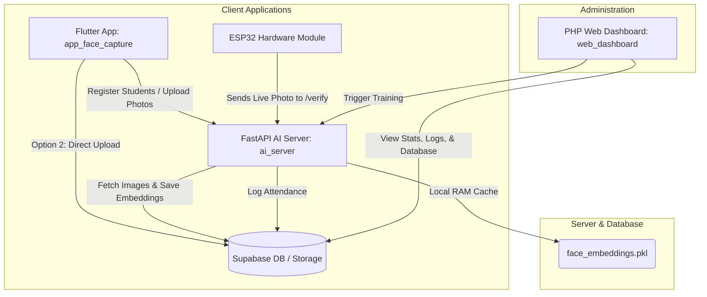

# Face Recognition Attendance System (FaceAttend)

An end-to-end, high-accuracy, AI-powered attendance system featuring local-edge verification and cloud database persistence. The system bridges a Flutter registration client, an ESP32 hardware camera module, a FastAPI AI engine server, and a PHP-based web administration dashboard.

## System Architecture



The system operates on a **hybrid edge-cloud model**:
- **Data Persistence**: All persistent data (student info, registration queue, check-in logs, raw images) is stored in the cloud via **Supabase** (with a local **SQLite** fallback for offline execution).
- **Zero-Network In-Memory Matching**: Face matching is performed directly in the RAM of the FastAPI server using localized, serialized `.pkl` embeddings generated during model training. This guarantees sub-second verification latency and reduces cloud database load.

---

## Project Structure

This monorepo contains the following modules:

| Directory | Language/Framework | Description |
| :--- | :--- | :--- |
| [`ai_server/`](file:///D:/AIproject/ai_server) | Python / FastAPI / InsightFace | The AI core. Decodes images, extracts face embeddings, performs cosine similarity matching, trains the model, and hosts the API. |
| [`app_face_capture/`](file:///D:/AIproject/app_face_capture) | Dart / Flutter | Cross-platform app used to register students and capture the 10 required face photos using automated countdowns and progress guides. |
| [`web_dashboard/`](file:///D:/AIproject/web_dashboard) | PHP / JS / CSS | Admin control panel to monitor attendance logs in real time, view registered students, and manage the registration queue. |
| [`esp32_system/`](file:///D:/AIproject/esp32_system) | C++ (Arduino) | Firmware code for the physical ESP32 device equipped with a camera module (e.g. OV2640) to scan faces and trigger attendance check-ins. |

---

## Core Flows

### 1. Student Face Registration
1. Admin enters student details in the **Flutter App**.
2. Flutter app starts a **3-second alignment countdown** followed by capturing **10 photos** sequentially.
3. Photos are either sent to `ai_server/` (`Option 1`) or uploaded directly to Supabase storage (`Option 2`).
4. In `Option 1`, the server runs face detection and single-face quality checks before writing metadata to the Supabase database registration queue.

### 2. Model Training
1. Registered images are processed by the server (either immediately or triggered manually via the **Admin Portal** in the Flutter app / Web Dashboard).
2. The server downloads the 10 images for the student, runs them through the **ArcFace (InsightFace)** model to extract numerical embeddings, serializes them into `data/face_embeddings.pkl`, and invalidates the active matching RAM cache.

### 3. Face Verification (Check-In)
1. The **ESP32 camera module** captures a face at the entrance and sends a POST request with the image payload to the server's `/verify` endpoint.
2. The server compares the face embedding against the memory-cached `.pkl` database.
3. If similarity exceeds the configured threshold, the user is identified, a check-in success is returned to the ESP32 (to trigger a buzzer or open a door), and an attendance record is logged to the database.

---

## Quick Start Guide

Detailed setup instructions are located in the respective subdirectories. Below is a high-level overview:

### Step 1: Start the Backend (AI Server)
1. Navigate to `ai_server/`.
2. Set up your virtual environment and install requirements:
   ```bash
   python -m venv venv
   source venv/bin/activate  # On Windows: .\venv\Scripts\Activate.ps1
   pip install -r requirements.txt
   ```
3. Configure your `.env` file with your Supabase details (or leave blank to use the local SQLite fallback).
4. Run the server:
   ```bash
   python app/main.py
   ```

### Step 2: Configure and Run the Web Dashboard
1. Navigate to `web_dashboard/`.
2. Copy `config.example.php` to `config.php` and insert your Supabase URL and **Service Role Key** (required to read/write attendance data).
3. Start the PHP server:
   ```bash
   php -S localhost:8080
   ```
4. Access the dashboard at `http://localhost:8080`.

### Step 3: Run the Face Capture App
1. Navigate to `app_face_capture/`.
2. Build and run the app on your phone or emulator:
   ```bash
   flutter pub get
   flutter run
   ```
3. Open Settings in the app and set your **Server Base URL** to point to your running AI server.

### Step 4: Deploy the ESP32 Module
1. Connect your ESP32-CAM module to your PC.
2. Open the source code inside `esp32_system/` in Arduino IDE or VS Code (PlatformIO).
3. Configure your WiFi credentials and your AI server base URL (`http://<SERVER_IP>:8000/verify`).
4. Flash the device.
