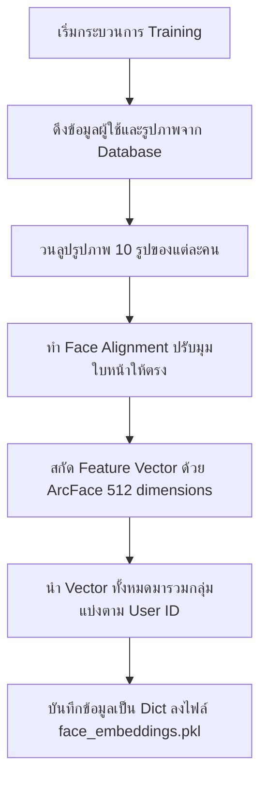
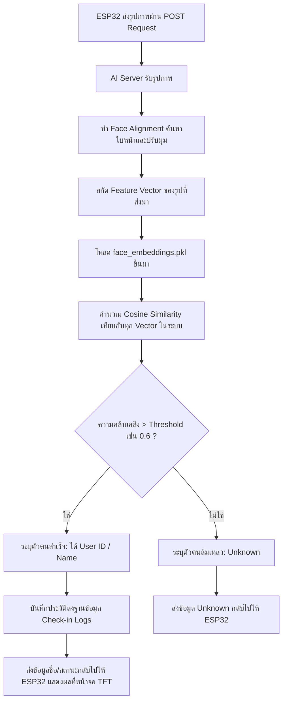

# การออกแบบระบบ AI Server (ai_server)

ระบบ **AI Server** มีหน้าที่หลัก 2 อย่างคือ **การเรียนรู้ใบหน้า (Training Phase)** จากรูปภาพในฐานข้อมูลเพื่อสร้างไฟล์โมเดลใบหน้า (.pkl) และ **การตรวจจับและระบุตัวตน (Inference/Verification Phase)** เมื่อได้รับรูปภาพจากบอร์ด ESP32-S3 CAM

---

## 1. สถาปัตยกรรมระบบ (System Architecture)

เราจะใช้ **Python** ร่วมกับเทคโนโลยีดังต่อไปนี้:

- **FastAPI**: เว็บเฟรมเวิร์กสำหรับสร้าง REST API มีประสิทธิภาพสูงและง่ายต่อการเชื่อมต่อกับ ESP32-S3 และแอปพลิเคชันอื่น
- **InsightFace (ArcFace Model)**: Library ที่มีความแม่นยำสูงมากในการทำ Face Detection, Face Alignment (จัดกึ่งกลางและปรับมุมใบหน้า) และ Feature Extraction (สกัดจุดเด่นใบหน้าออกมาเป็น Vector 512 มิติ)
- **SQLAlchemy & PostgreSQL/MySQL**: สำหรับดึงรูปภาพของบุคคลเพื่อนำมาเทรน และบันทึกประวัติการลงชื่อลง Database
- **Pickle (.pkl)**: สำหรับบันทึกความจำใบหน้า (Face Embeddings) ของทุกคนในระบบในรูปแบบกุญแจสำคัญ `{"user_id": ..., "name": ..., "embeddings": [vector_1, vector_2, ...]}` เพื่อนำมาใช้เปรียบเทียบใบหน้าในเวลารวดเร็ว

---

## 2. โครงสร้างโฟลเดอร์ที่ออกแบบ (Project Folder Structure)

```text
ai_server/
├── app/
│   ├── __init__.py
│   ├── main.py                 # จุดเริ่มต้นของ FastAPI (Inference Endpoint & Training Endpoint)
│   ├── config.py               # ค่ากำหนดระบบ (DB URL, Model Path, Similarity Threshold)
│   ├── database.py             # จัดการการเชื่อมต่อ Database (SQLAlchemy) และ Model/Schema
│   ├── face_processor.py       # จัดการ Face Alignment & Feature Extraction ด้วย InsightFace
│   ├── matcher.py              # จัดการการเปรียบเทียบ Embeddings (Cosine Similarity) กับไฟล์ .pkl
│   └── trainer.py              # สคริปต์สำหรับดึงรูปภาพจาก DB มาทำการ Alignment + Extraction แล้วเซฟเป็น .pkl
├── data/
│   └── face_embeddings.pkl     # ไฟล์ฐานข้อมูล Vector ใบหน้าที่ได้จากการเทรน
├── requirements.txt            # รายการไลบรารีที่จำเป็น
└── README.md                   # คู่มือการติดตั้งและใช้งาน
```

---

## 3. ขั้นตอนการทำงานอย่างละเอียด (Detailed Workflow)

### ส่วนที่ 1: การเรียนรู้ใบหน้า (Training / Embedding Generation)

กระบวนการนี้ทำงานเมื่อผู้ใช้กด "เทรนระบบ" หรือทำเป็นรอบเวลา (Cron Job) เพื่ออัปเดตใบหน้าใหม่:



### ส่วนที่ 2: การตรวจสอบและยืนยันตัวตน (Inference / Verification)

กระบวนการนี้ทำงานแบบ Real-time เมื่อ ESP32-S3 ส่งรูปภาพคนเดินผ่านเข้ามา:



---

## 4. รายละเอียดชุดคำสั่งของส่วนประกอบสำคัญ (Component Specifications)

### A. `face_processor.py` (ระบบประมวลผลภาพใบหน้า)

จะทำงานร่วมกับ InsightFace:

- **Face Alignment**: ใช้สกัด Landmark บนใบหน้า (ตา, จมูก, มุมปาก) เพื่อนำมา Rotate และ Scale ให้ใบหน้าอยู่ในระนาบตรงระดับเดียวกันเสมอ เพื่อลดผลกระทบจากแสงเงาและการเอียงหน้า
- **ArcFace Feature Extraction**: แปลงรูปใบหน้าที่ผ่านการ Align แล้วให้กลายเป็น Array ตัวเลข 512 ตัว (Embedding Vector) ซึ่งมีคุณสมบัติที่คนคนเดียวกันจะมีทิศทาง Vector ใกล้เคียงกันมาก

### B. `matcher.py` (ระบบค้นหาใบหน้าที่ตรงกัน)

- คำนวณความคล้ายคลึงด้วย **Cosine Similarity** หรือ **L2 Distance** (ในที่นี้แนะนำ Cosine Similarity) ระหว่าง Vector ล่าสุดกับ Vector ในระบบ
- ตั้งค่า **Threshold** (เช่น `0.60` - `0.65` ซึ่งเป็นค่ามาตรฐานของ ArcFace) เพื่อลดความผิดพลาด (False Positive)
- คัดกรองผลลัพธ์ที่ดีที่สุด (Max Similarity) และส่งผลลัพธ์ออกไป

### C. `database.py` (ระบบฐานข้อมูล)

โครงสร้างตารางหลักที่ต้องเชื่อมต่อ:

1. **ตาราง `users` (พนักงาน/สมาชิก)**:
   - `id` (Primary Key)
   - `name` (ชื่อ-นามสกุล)
   - `created_at`
2. **ตาราง `user_images` (รูปภาพจาก app_face_capture)**:
   - `id` (Primary Key)
   - `user_id` (Foreign Key -> users.id)
   - `image_path` หรือ `image_blob` (แนะนำเก็บเป็นพาธรูปภาพ หรือ BLOB รูปภาพขนาดเหมาะสม)
3. **ตาราง `check_in_logs` (ประวัติการสแกนผ่าน ESP32)**:
   - `id` (Primary Key)
   - `user_id` (Foreign Key -> users.id, nullable=True สำหรับกรณี Unknown)
   - `timestamp` (เวลาลงชื่อเข้าใช้งาน)
   - `similarity_score` (คะแนนความเหมือนเพื่อใช้ตรวจสอบย้อนหลัง)
   - `device_id` (รหัสเครื่อง ESP32)

---

## 5. แนะนำรายการ Libraries (`requirements.txt`)

```text
fastapi==0.110.0
uvicorn==0.28.0
insightface==0.7.3
onnxruntime==1.17.1
opencv-python-headless==4.9.0.80
numpy==1.26.4
sqlalchemy==2.0.28
pymysql==1.1.0
pillow==10.2.0
pandas==2.2.1
```

_(หมายเหตุ: InsightFace จำเป็นต้องติดตั้ง C++ Build Tools บนระบบก่อนติดตั้ง หรือติดตั้งผ่าน pre-built wheel และจำเป็นต้องใช้ ONNX Runtime ในการรัน ArcFace Model)_
