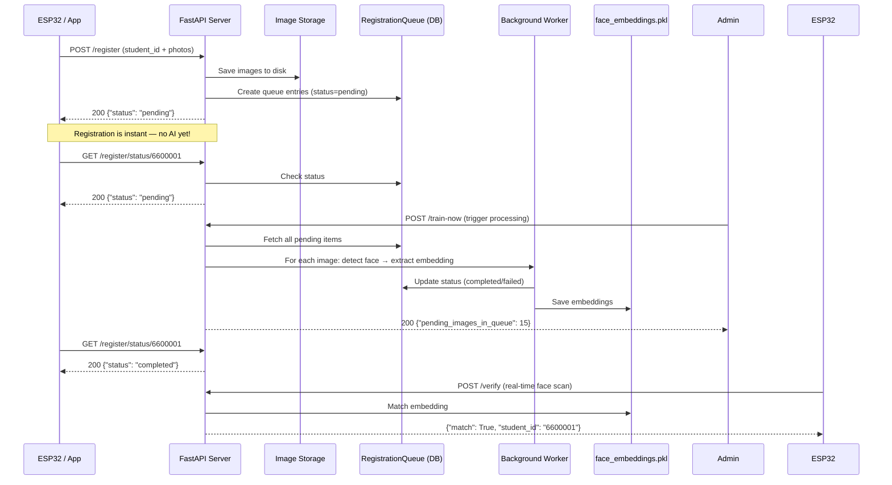

# Real-World Workflow: Face Registration & Attendance (Async Queue Version)

This guide shows the **asynchronous queue-based workflow** for registering new faces and taking attendance in production.

> **Why async queue?**
>
> - When 100+ students register simultaneously, the server stays responsive
> - `/register` saves images to disk + queues them — returns immediately (no waiting for AI)
> - AI processing happens in background via `/train-now` or scheduled worker
> - ESP32-S3 verification remains real-time and unaffected by registration load

---

## Part 1: How the Async System Works



---

## Part 2: Registering a New Face (Async)

### Step 1: Prepare Photos

| Do This                               | Avoid This                          |
| ------------------------------------- | ----------------------------------- |
| Front-facing, looking at camera       | Side profiles                       |
| Good lighting (natural light is best) | Dark or backlit photos              |
| Clear, not blurry                     | Blurry or pixelated images          |
| Neutral expression                    | Extreme expressions (yawning, etc.) |

**Recommended photo count:** 1-3 photos per person (front-facing, well-lit)

---

### Step 2: Upload Photos (Non-blocking)

**Method:** POST
**URL:** `http://<VM-IP>:8000/register`
**Headers:** None
**Body:** `form-data`

- Key: `student_id` (type: **Text**) — e.g., "6600001"
- Key: `files` (type: **File**) — Select 1-3 photos (hold Ctrl/Cmd for multiple)

**Click Send**

**Response (instant — no AI wait):**

```json
{
  "message": "Images queued for processing successfully",
  "student_id": "6600001",
  "status": "pending"
}
```

**What happened:**

1. User profile created/updated in database
2. Images saved to `data/uploads/` on disk
3. Queue entries created with `status="pending"`
4. **Response returned immediately — AI not yet run!**

---

### Step 3: Trigger AI Processing

**Option A: Manual Trigger (Recommended for testing)**

Call `/train-now` to process all pending queue items immediately:

**Method:** POST
**URL:** `http://<VM-IP>:8000/train-now`

**Response:**

```json
{
  "message": "Background training started",
  "pending_images_in_queue": 3
}
```

**Option B: Scheduled Worker (Recommended for production)**

Set up a cron job or scheduler that calls `/train-now` every few minutes:

```bash
# Every 5 minutes
*/5 * * * * curl -X POST http://<VM-IP>:8000/train-now
```

---

### Step 4: Check Processing Status

**Method:** GET
**URL:** `http://<VM-IP>:8000/register/status/6600001`

**Response (pending):**

```json
{
  "student_id": "6600001",
  "status": "pending",
  "message": "Waiting for AI processing"
}
```

**Response (completed):**

```json
{
  "student_id": "6600001",
  "status": "completed",
  "message": "Face extracted and saved successfully"
}
```

**Response (failed — no face detected):**

```json
{
  "student_id": "6600001",
  "status": "failed",
  "message": "No face detected, please upload a new clear image"
}
```

---

### Step 5: Verify Registration Works

**Method:** POST
**URL:** `http://<VM-IP>:8000/verify`
**Body:** `form-data`

- Key: `file` (type: **File**) — Upload a test photo

**Expected Response:**

```json
{
  "match": true,
  "student_id": "6600001",
  "similarity_score": 0.85,
  "timestamp": "2026-06-24T12:30:00"
}
```

---

### Registration Checklist (Async)

- [ ] Prepared 1-3 clear front-facing photos
- [ ] Called `POST /register` with `student_id` + photos → received `"status": "pending"`
- [ ] Called `POST /train-now` to trigger AI processing
- [ ] Checked `GET /register/status/6600001` → `"status": "completed"`
- [ ] Verified with test photo via `/verify` → `match: true`

---

## Part 3: Taking Attendance (Face Verification)

### Real-time with ESP32-S3

1. **ESP32-S3 captures face** automatically when person stands in front
2. **ESP32 sends photo** to `POST /verify` via HTTP
3. **Server matches against trained embeddings** (instant, real-time)
4. **ESP32 displays result** on TFT screen

**ESP32 sends:**

```http
POST http://<VM-IP>:8000/verify
Content-Type: multipart/form-data
[image data]
```

**Server responds (Match Found):**

```json
{
  "match": true,
  "student_id": "6600001",
  "similarity_score": 0.85,
  "timestamp": "2026-06-24T12:30:00"
}
```

**Server responds (Unknown):**

```json
{
  "match": false,
  "student_id": null,
  "similarity_score": 0.0,
  "timestamp": "2026-06-24T12:30:00"
}
```

### View Attendance Logs

**Method:** GET
**URL:** `http://<VM-IP>:8000/logs`

**Response:**

```json
[
  {
    "id": 1,
    "student_id": "6600001",
    "similarity_score": 0.85,
    "device_id": "ESP32-S3-01",
    "timestamp": "2026-06-24T12:30:00"
  }
]
```

---

## Part 4: API Endpoint Reference

| API                             | Method | Purpose                         | Key Fields               | Notes                              |
| ------------------------------- | ------ | ------------------------------- | ------------------------ | ---------------------------------- |
| `/`                             | GET    | Health check                    | —                        | Returns `{"status": "ok"}`         |
| `/register`                     | POST   | Upload photos to queue          | `student_id` + `files`   | ⭐ **Async** — returns immediately |
| `/register/status/{student_id}` | GET    | Check AI processing status      | —                        | Returns pending/completed/failed   |
| `/train-now`                    | POST   | Process all pending queue items | —                        | Manual trigger for background AI   |
| `/verify`                       | POST   | Real-time face recognition      | `file` or `image_base64` | Match + logs attendance            |
| `/logs`                         | GET    | Attendance history              | `?limit=50`              | Shows recent check-in records      |

### Legacy Endpoints (Still Supported)

| API                  | Method | Purpose                         |
| -------------------- | ------ | ------------------------------- |
| `/users`             | POST   | Create user profile             |
| `/users`             | GET    | List all users                  |
| `/users/{id}/images` | POST   | Upload image for existing user  |
| `/train`             | POST   | Full retrain from all DB images |

---

## Part 5: Architecture Comparison

| Aspect                 | Old Sync System                                   | New Async Queue System                                   |
| ---------------------- | ------------------------------------------------- | -------------------------------------------------------- |
| `/register` behavior   | Blocks while AI extracts embeddings (can timeout) | Returns instantly — queues for later processing          |
| Handling 100+ students | Server overload, slow responses                   | All requests processed instantly, AI works in background |
| AI processing          | Only when `/train` is called                      | Via `/train-now` trigger or scheduled worker             |
| Image storage          | Base64 in database only                           | Disk storage + DB path reference                         |
| Registration status    | Unknown (no status tracking)                      | Trackable via `/register/status/{id}`                    |
| Error handling         | Fails silently                                    | Marked as `failed` with error message                    |

---

## Quick Reference Card

```
ASYNC REGISTRATION FLOW:
1. POST /register          → Upload student_id + 1-3 photos → gets "pending"
2. POST /train-now         → Process all queued images (AI extracts faces)
3. GET /register/status/id → Check if processing is complete

DAILY ATTENDANCE:
1. POST /verify            → Send photo, get match result
2. GET /logs               → View attendance records

DATABASE:
Location: ai_server/face_recognition.db
Images:   ai_server/data/uploads/
```
