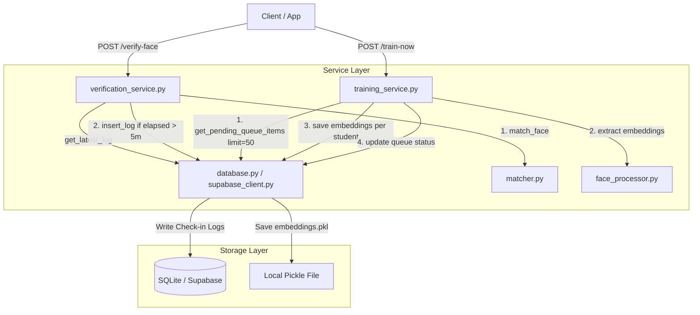

# Design Spec: AI Server Training Optimization & Check-in Cooldown

This document details the architectural and logical updates to the AI Server of the Face Recognition Attendance system. The changes address the core backend performance, crash resilience, and database check-in rate limiting issues.

---

## 1. Objectives

*   **Force Train Optimization**: Prevent the `/train-now` and `/train` endpoints from freezing/blocking when processing large registration queues.
*   **Crash Resilience**: Implement periodic, atomic embedding file updates to guarantee that trained face embeddings are not lost if the server crashes or restarts.
*   **Verification Cooldown**: Implement a 5-minute check-in cooldown per student to eliminate duplicate entry spam in the database.

---

## 2. System Architecture & Components

The updates span the Database, Router/API, and Service layers of the `ai_server` module.

---

## 3. Detailed Data Flow

### A. Training Service Flow (Approach 1: Client-Triggered Batching)

1.  **Retrieve Batch**: The service queries `get_pending_queue_items(limit=50)`.
2.  **Group by Student**: Pending image paths are grouped locally by `student_id`.
3.  **Iterate Student**: For each student:
    *   Initialize an empty list for new embeddings.
    *   Iterate through all queued items for this student:
        *   Decode image path and extract embedding.
        *   If successful, add to list and record queue status as `completed`.
        *   If failed, record queue status as `failed` with error message.
    *   **Atomic Save**: If new embeddings were extracted:
        *   Load current embeddings from `embeddings.pkl`.
        *   Filter out any prior record matching the `student_id` to avoid duplication.
        *   Append the newly extracted embeddings block.
        *   Write back to `embeddings.pkl`.
        *   Call `invalidate_cache()` to reload embeddings in the matcher.
    *   **Database Sync**: Update statuses of the processed items in the database.

> [!IMPORTANT]
> The database statuses are updated **only after** the pickle file is written. This guarantees that if the server crashes during processing, the database entries remain `pending` and are retried in subsequent batches.

### B. Face Verification Cooldown Flow

1.  **Extract Face Embedding**: Match input image against current matcher cache.
2.  **Match Found**: If matched:
    *   Query the database using `get_latest_check_in_log(student_id)`.
    *   If a log exists:
        *   Parse the timestamp (accounting for SQL `datetime` or Supabase ISO string format).
        *   Calculate the elapsed time in seconds.
        *   If `elapsed < 300` (5 minutes):
            *   Return success response (`match: True`) with message `"Student has already checked in within the last 5 minutes."`
            *   **Skip database insertion**.
    *   If no recent log (or `elapsed >= 300`):
        *   Insert a check-in log row into the database.
        *   Return standard success response.

---

## 4. Error Handling & Edge Cases

*   **Corrupted Images in Batch**: If one image of a student fails, it is marked as `failed` in the database, but processing continues for other images of that student. Embeddings from the successful images are still saved.
*   **Database Offlining/Connection Drop**: If Supabase or SQLite drops mid-batch, database commits fail. The process raises an exception, keeping the state of the remaining queue items as `pending` so they will be retried.
*   **Timezone Discrepancies**: Timestamps are parsed and normalized to UTC naive datetimes (`replace(tzinfo=None)`) before performing time-delta calculations, ensuring consistency across servers and environments.

---

## 5. Verification Plan

### Test Case 1: Training Queue Batching
*   **Setup**: Insert 60 pending items into the queue (e.g., student A: 10, student B: 10, ... student G: 10).
*   **Action**: Invoke `/train-now`.
*   **Expected Outcome**: Only 50 items are processed. The `total_pending` in response is 50. 5 students are trained and marked `completed` in the DB. The remaining 10 items for student G stay `pending`. A second invocation processes the last 10 items.

### Test Case 2: Crash Recovery during Training
*   **Setup**: Insert 10 pending items for student A. Force an exception/server kill mid-way during processing.
*   **Expected Outcome**: If killed before pickle file save, database rows remain `pending`. On server restart, a retry processes them cleanly. If killed after pickle save but before DB update, the DB rows stay `pending`, leading to a redundant but safe re-processing on the next run.

### Test Case 3: 5-Minute Cooldown
*   **Setup**: Submit successful verification request for student X.
*   **Action 1**: Verify immediately after.
*   **Expected Outcome**: Database has exactly 1 check-in log. The second request returns `match: True` but with message indicating cooldown.
*   **Action 2**: Verify 6 minutes later.
*   **Expected Outcome**: Database gets a 2nd log entry.
