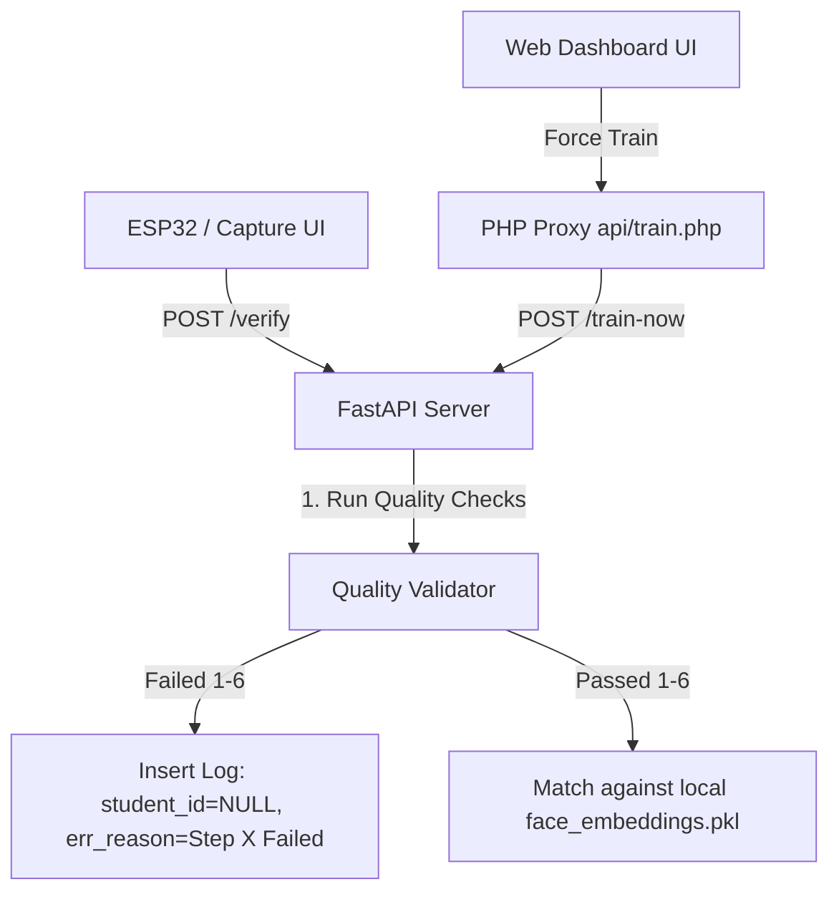

# Image Quality Validation and Diagnostics Design Spec

This spec outlines the design for implementing **Image Quality Validation** on the FastAPI backend during face capture/verification, and **Diagnostic Logs** inside the Web Dashboard queue list.

---

## 1. Goal & Context
The AI attendance system requires high-quality face captures to maintain high verification accuracy. Processing poor-quality images (blurry, off-center, or occluded faces) wastes CPU resources, increases false recognition rates, and provides poor feedback to users. 

This feature adds a robust 7-step quality checkpoint for every incoming image:
1. **Face Detection**: Verify that at least one face exists.
2. **Single Face Check**: Verify that there is exactly one face in the frame.
3. **Blur/Motion Check**: Check image clarity using Laplacian variance (threshold: `100`).
4. **Distance Check**: Check absolute face size in pixels (minimum: `120x120` px).
5. **Orientation Check**: Calculate head tilt (roll) and head turn (yaw/pitch) (maximum deviation: `20°`).
6. **Obstruction Check**: Validate keypoint confidence/overall detection score (minimum detector score: `0.6`).
7. **Database Matching**: Attempt matching ONLY if steps 1-6 pass.

Failures from the Kiosk (`/verify` endpoint) or the registration pipeline (`/register` and `/train`) are recorded with specific step reasons and returned to the Web Dashboard. The dashboard displays the failures in a 2-tab expandable panel under the student rows.

---

## 2. Technical Architecture



### Components

#### A. AI Server Side (Python)

##### 1. Quality Validation Utility
Modify `FaceProcessor` inside [face_processor.py](file:///D:/AIproject/ai_server/app/face_processor.py) to add a validation method:
- **Blur Variance**: Convert BGR to grayscale and compute:
  ```python
  variance = cv2.Laplacian(gray_img, cv2.CV_64F).var()
  ```
- **Face Size**: Check bounding box dimensions: `(x2 - x1) >= 120` and `(y2 - y1) >= 120`.
- **Face Orientation**: Check symmetry of keypoints (left eye vs right eye distance, nose centering).
- **Obstruction**: Check `det_score >= 0.6`.

##### 2. Check-in Logs Table Schema Update
We need to update [models.py](file:///D:/AIproject/ai_server/app/models.py) and database schemas (both Supabase PostgreSQL and SQLite fallback) to add an `error_message` or `failure_reason` column to the `check_in_logs` table (and `registration_queue` table if not already present).
- If SQLite is active, run an automatic schema migration (e.g. `ALTER TABLE check_in_logs ADD COLUMN error_message VARCHAR;`) on startup.

##### 3. API Updates
- **`POST /verify`**: If validation fails at step $N$, log the entry to the DB with `student_id = NULL`, `similarity_score = 0.0`, and `error_message = <reason>`. Return HTTP 200 with:
  ```json
  {
    "match": false,
    "student_id": null,
    "similarity_score": 0.0,
    "timestamp": "...",
    "message": "Step X Failed: <reason>",
    "validation_checklist": {
      "face_detected": true,
      "single_face": true,
      "blur_passed": false,
      "distance_passed": true,
      "orientation_passed": true,
      "obstruction_passed": true,
      "database_match": false
    }
  }
  ```
- **`POST /register`**: Pre-validate files. If any fails steps 1-6, return HTTP 400 Bad Request with the validation checklist.
- **`process_pending_queue`**: Screen images during background training. If failed, set queue status to `failed` and write the failure reason to the queue record.

#### B. Web Dashboard Side (PHP & JS)

##### 1. Expandable Rows
- In `web_dashboard/index.php`, render a `▶` toggle arrow next to student rows.
- On click, slide down a detailed layout panel.

##### 2. 2-Tab Panel (Approach 2 with Photo Preview Removed)
- **Tab 1: ⚠️ Failure Checklist**: A vertical list of the 7 steps, colored using green/red badges based on the validation checklist.
- **Tab 2: 📊 Raw Data**: A code tag showing the formatted JSON payload from the server.

---

## 3. Database Schema Modification
We will add `error_message` column (nullable string) to both:
- `check_in_logs`
- `registration_queue`

---

## 4. Verification Plan

### Automated Tests
- Test cases verifying blur detection on synthetic/real blurred images.
- Test cases verifying too-small bounding boxes.
- Test cases verifying tilted face keypoints.
- Test cases verifying the `/verify` response payload structure on validation failure.

### Manual Verification
- Uploading a blurry image to register/verify and checking that the dashboard displays the correct failure checklist.
